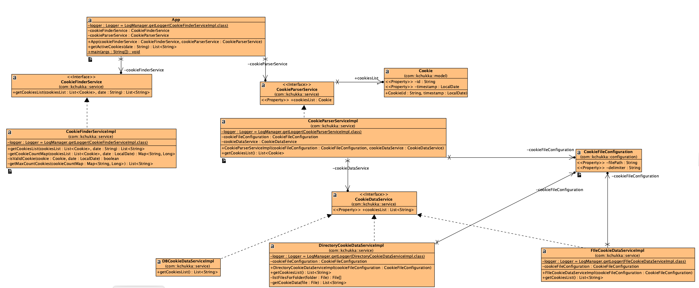

# Cookies

## Pre-requisite
* Java 8

## Instructions

```
git clone https://github.com/kishorechk/cookies.git

cd cookies

./mvnw package

./cookies-finder.sh -fcookies.csv -d2018-12-09
```

## Assumptions
* the data file will be csv format. Each record will be have two fields - cookie, timestamp. The solutio ignores records with invalid timestamp.
* If multiple cookies meet that criteria, please return all of them on separate lines.
* -d parameter takes date in UTC time zone.
* have enough memory to store the contents of the whole file. The solution loads the whole file into memory, then finds the matching records.
* Cookies in the log file are sorted by timestamp (most recent occurrence is the first line of the file). The solution uses binary search to find the matching cookies to improve performance
* Currently the solution doesnt maintain cache of the file data, it reads the file every request. The solution can be extended to support cache.

## Class Diagram

